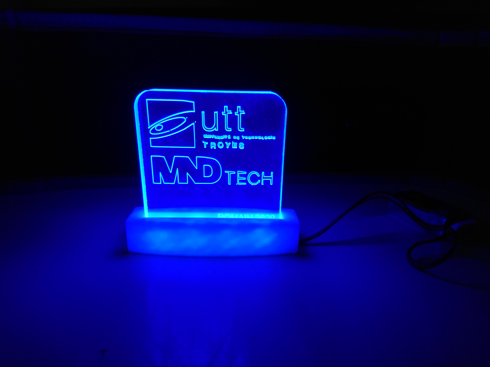

# UTT LED decoration

The manufacturing of this project has been through CNC and PCB milling and 3D printing.

It was originally created for a high school workshop : each student designed its own and then made it.

## PCB :

You can find it in the PCB_deco_plexi_LED directory, it was made with KiCad.

## Base :

It was made with FreeCAD : Base_3D_printer_deco_led.FCStd

There is also an STL export : Base.stl

## Plexiglass :

It has been made especially for the UTT CNC software (charly robot) : LogoPlexiUTT.grl

## Licence :

This work is licensed under a <a rel="license" href="http://creativecommons.org/licenses/by-sa/4.0/">Creative Commons Attribution-ShareAlike 4.0 International License</a>.

Romain THOMAS 2020