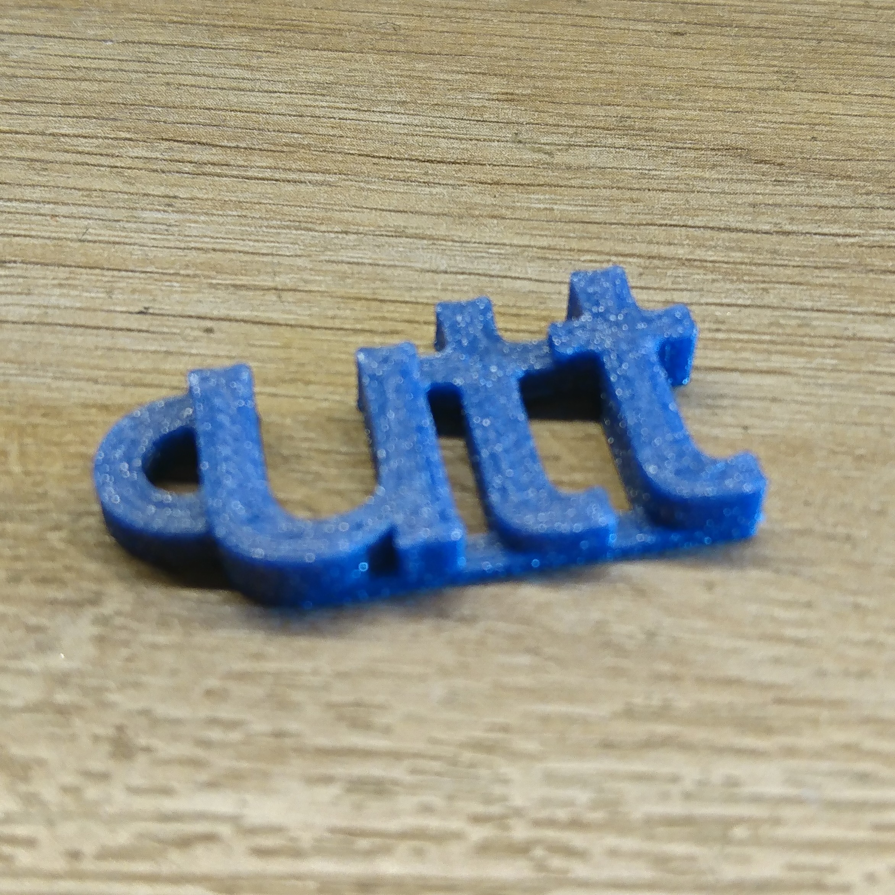

# UTT Keychain

This model is designed to be 3D printed.

It was originally created to be given to each new UTT student in 2020.

It has been made with FreeCAD, you can edit the model or directly use the STL file

## Licence :

This work is licensed under a <a rel="license" href="http://creativecommons.org/licenses/by-sa/4.0/">Creative Commons Attribution-ShareAlike 4.0 International License</a>.

Romain THOMAS 2020